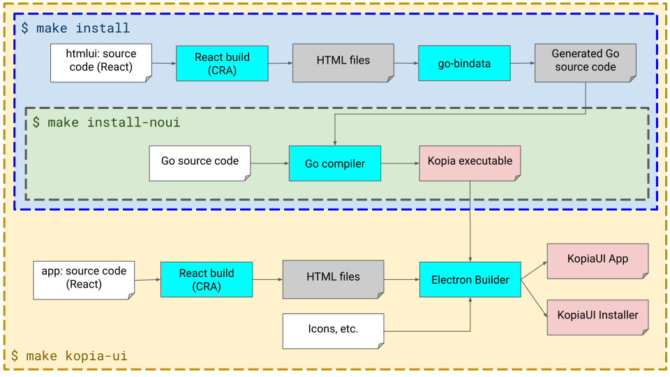

# Kopia Build Architecture


Kopia build pipeline is set up to generate the following artifacts:

* Standalone `kopia` executable for all supported platforms, optionally with embedded graphical UI
* KopiaUI - desktop app for all supported platforms: Windows, macOS, and Linux
* The static content of [kopia.io](https://kopia.io) website

Kopia build is based on `Makefile` and provides the following main targets:

* `$ make install` - builds full `kopia` command-line executable that also embeds graphical UI components that can be used in a browser. The output is stored in `$HOME/go/bin/kopia`

* `$ make install-noui` - builds simplified `kopia` executable without embedded graphical UI. The output is stored in `$HOME/go/bin/kopia`

* `$ make kopia-ui` - builds desktop application based on [Electron](https://electronjs.org) using [Electron Builder](https://electron.build) The output is stored in the `dist/kopia-ui` subdirectory

* `$ make website` - builds [kopia.io](https://kopia.io) website using [Hugo](https://gohugo.io). The output is stored in `site/public` and published to [Github Pages](https://github.com/kopia/kopia.github.io) from [Travis CI](https://travis-ci.org/kopia/kopia) on each build.

The project structure is also compatible with `go get`, so getting the latest Kopia command line tool (albeit without any UI functionality) is as simple as:

```
$ go get github.com/kopia/kopia
```

## Build Pipeline Overview

The following picture provides high-level overview of the build pipeline.



## HTML UI

THe HTML UI builds HTML-based user interface that is embedded in Kopia binary by using [go-bindata](github.com/go-bindata/go-bindata).

The UI is build using [React](https://reactjs.org) and more specifically [Create React App](https://reactjs.org/docs/create-a-new-react-app.html#create-react-app) toolchain.

When developing the UI, the most convenient way is to use two terminals. The first terminal runs `kopia server` without the UI. The second one runs development server of React with hot-reload, so changes are immediately reflected in the browser. 

In the first terminal do:

```shell
$ make install-noui && $HOME/go/bin/kopia server
```

In the second terminal do:

```shell
$ make -C htmlui dev
```

This will automatically open the browser with the UI page on http://localhost:3000. Changing any file under `htmlui/` will cause the browser to hot-reload the change. In most cases, the changes to the kopia server don't even require reloading the browser.

To make sure HTML pages compile correctly use:

```shell
$ make -C htmlui build-html
```

To convert generated HTML to embedded go source code use:

```shell
$ make html-ui-bindata
```

To manually build the `kopia` binary with the embedded HTML that was just generated in the previous step:

```shell
$ go install -tags embedhtml
```
or
```shell
$ make install
```

When compiling Go code without `embedhtml` build tag, the embedded UI will be just a placeholder. This is equivalent to:

```shell
$ make install-noui
```

## KopiaUI App

KopiaUI is built using [Electron](https://electronjs.org) and packaged as native binary using [Electron Builder](https://electron.build). The app is just a shell that invokes `kopia server --ui` and connects the browser to it, plus it provides native system tray integration. Kopia executable is embedded as a resource inside KopiaUI app, to simplify usage.

To build the app:

```shell
$ make kopia-ui
```

The generated app will be in:

* `dist/kopia-ui/win-unpacked` on Windows
* `dist/kopia-ui/mac/KopiaUI.app` - on macOS
* `dist/kopia-ui/linux-unpacked` on Linux

When developing the app shell it is convenient to simply run Electron directly on the source code without building.

```shell
$ make -C app dev
```

>NOTE: this also opens the browser window due to CRA development server, but it can be safely disregarded. Because KopiaUI configuration pages are built using CRA, they also benefit from hot-reload while developing this way.

## Website

The [kopia.io](https://kopia.io) website is built using [Hugo](https://gohugo.io).

To build the website use:

```shell
$ make -C site build
```

This will auto-generate [Markdown](https://en.wikipedia.org/wiki/Markdown) files with documentation for currently supported Kopia CLI subcommands and store them under `site/content/docs/Reference/Command-Line` and then generate the website which is stored in `site/public`.

To see the  website in a browser it's more convenient to use:

```shell
$ make -C site server
```

This starts a server on http://localhost:1313 where the website can be browsed.

