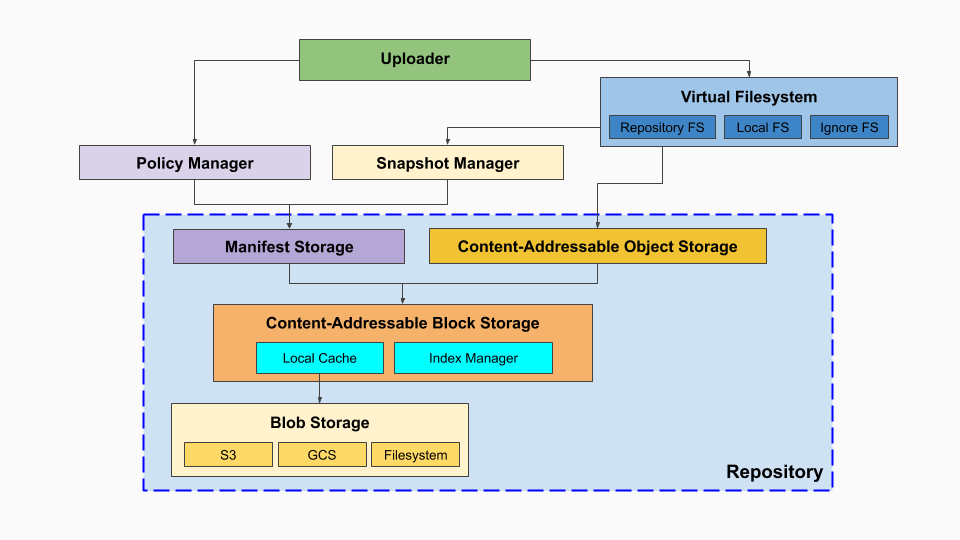

Kopia stores its data in a data structure called Repository.

Repository adapts simple storage such as NAS filesystem, Google Cloud Storage or Amazon S3 to add features such as encryption, deduplication, content-addressability and ability to maintain rich snapshot history.

The following diagram illustrates the key components of Kopia:



### Binary Large Object Storage (BLOB)

BLOB storage is the place where your data is ultimately stored. Any type that implements simple Go [API](https://godoc.org/github.com/kopia/kopia/repo/blob#Storage) can be used as Kopia's blob storage.

See the [Repositories](/docs/repositories/) page for a list of currently supported storage backends.

Cloud storage solutions (such as GCS, S3 or Azure Blob Storage) are great choices because they provide high availability and data durability at reasonable prices.

Kopia does not require low-latency storage, it uses caching and other optimizations to be able to work efficiently with high-latency backends.

The API for BLOB storage can be found in https://godoc.org/github.com/kopia/kopia/repo/blob

### Content-Addressable Block Storage (CABS)

BLOB storage by itself does not provide the features that Kopia needs (encryption, de-duplication), so we're using content-addressable block storage layer to add those key features.

Content-Addressable Block Storage manages data blocks of relatively small sizes (typically <=20MB). Unlike BLOB storage where we can freely pick a filename, CABS assigns an identifier called **Block ID** to each block of data that gets stored.

Block ID is generated by applying [cryptographic hash function](https://en.wikipedia.org/wiki/Cryptographic_hash_function) such as SHA2 or BLAKE2S to produce a pseudo-random identifier, such as `6a9fc3a464a79360269e20b88cef629a`.

A key property of block identifiers is that two identical block of data will produce exactly the same identifiers, thus resulting in natural de-duplication of data.

After hashing, the block data is encrypted using algorithm such as `AES256-GCM-HMAC-SHA256` or `CHACHA20-POLY1305-HMAC-SHA256`. To make uploads to cloud storage more efficient and cheaper, multiple smaller blocks are combined into larger **Packs** of 20-40MB each. Pack files in blob storage have random names and don't reveal anything about their contents or structure. Their sizes are also generally unrelated to content due to splitting and merging.

To help efficiently find a block in the blob storage, CABS maintains an index that maps block ID to the blob file name, offset within the file and length. In addition, to make data recovery possible in case the index files got corrupted, a local index is also stored at the end of each pack.

File names in the BLOB layer have prefixes to help quickly identify its type:

* `p` represents packs containing data (e.g. `pb4cf8ca179d71478fb8d4b00b79a9a72`)
* `q` represents packs containing metadata  (e.g. `q7a9939814e8aba1fdda2d87965f324d3`)
* `x` represents indices (e.g. `xn0_20db7984bd71c4042cea471a61fbcea1`)

CABS is not meant to be used directly, instead it's a building block for object storage (CAOS) and manifest storage layers (LAMS) described below.

The API for CABS can be found in https://godoc.org/github.com/kopia/kopia/repo/content

### Content-Addressable Object Storage (CAOS)

Content-Addressable Object Storage allows storing binary objects of arbitrary sizes. Small objects are stored directly as individual CABS blocks, but larger objects need to be split into many smaller blocks before they can be stored.

**Object IDs** represent CAOS objects and are similar to Block IDs in that they are derived from object data. In fact for small blocks they are both identical: every valid Block ID is also valid Object ID representing the same contents.

Object IDs can also have an optional single-letter prefix `g..z` that helps quickly identify its type:

* `k` represents directory listing (e.g. `kfed1b0498dc54d07cd69f272fb347ca3`)
* `m` represents manifest block (e.g. `m0bf4da00801bd8c6ecfb66cffa67f32c`)
* `x` represents indirect JSON content (e.g. `xac47f7ce280fdd81f04c670fec2353dc`)

Objects without prefixes are stored in the `p` pack while objects with prefixes are stored in the `q` metadata pack by the CABS layer.

To represent objects larger than the size of a single CABS block, Kopia links together multiple blocks via special indirect JSON content. Such blocks are distinguished from regular blocks the `I` virtual prefix. Indirection can be applied to any object type, including metadata such as directory listing. However, when applied to a data block, an `x` prefix is added to ensure than the indrect JSON is stored in a metadata pack instead of a data pack by the CABS layer.

For example large file object might have an identifier such as `Ixac47f7ce280fdd81f04c670fec2353dc` and JSON content:

```json
{"stream":"kopia:indirect","entries":[
  {"l":2617867,"o":"e510796ba6ffd15649ea400b67ef6159"},
  {"s":2617867,"l":2751278,"o":"5c090744e0cad69d0d1aecd4ffd69f69"},
  {"s":5369145,"l":2476164,"o":"1f780f1a968fcdaa9e3a51961ce1cd8a"},
  {"s":7845309,"l":2640451,"o":"c03399d1d2fb13c48c062d1243deef91"}
]}
```

The [content list](/docs/reference/command-line/advanced/content-list/) command can be used to list CABS blocks in the repository:

```shell
$ kopia content list
```

The [content show](/docs/reference/command-line/advanced/content-show/) command can be used to show the content of a specific CABS block:

```shell
# Show the content of a directory listing
$ kopia content show kfed1b0498dc54d07cd69f272fb347ca3
# Show the indirect JSON content of a large file object
$ kopia content show xac47f7ce280fdd81f04c670fec2353dc
# Show the actual content of a large file object
$ kopia content show Ixac47f7ce280fdd81f04c670fec2353dc
```

Note that the example above shows that `I` is a virtual prefix. The actual CABS block does not content the `I` prefix but referencing the block with the `I` prefix tells Kopia to interprete the block as an indirect JSON object and return the resolved content instead of the raw content.

The API for CAOS can be found in https://godoc.org/github.com/kopia/kopia/repo/object

### Label-Addressable Manifest Storage (LAMS)

While content-addressable storage is a neat idea, dealing with cryptographic hashes is not very convenient for humans to use.

To address that, Kopia supports another type of storage, used to persist small JSON objects called **Manifests** (describing snapshots, policies, etc.) which are identified by arbitrary `key=value` pairs called labels.

Internally manifests are stored as CABS blocks.

The API for LAMS can be found in https://godoc.org/github.com/kopia/kopia/repo/manifest
