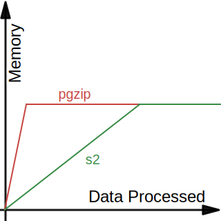

## Compression

Kopia offers internal content compression feature. Each data block stored may be compressed with the algorithm of user choice.

Here is how the whole process works in a summary (with the [architecture](/docs/advanced/architecture/) in your belly first). When Kopia sees a file to backup, it first splits its data into "chunks" with the configured splitter. Then compute its hash with the configured hash algorithm, and compare it against the existing database. If a matching hash is found, this chunk is already stored, thus can be safely discarded. Otherwise, Kopia applies the compression algorithm on the chunk, encrypt it, and pack a few of such into a blob if fit.

Kopia allows user to set compression algorithm, minimum and maximum file size and extensions to compress, on per-policy basis. Below we will discuss how these settings would interact with the data to be backed up.

To see how much data is saved by compression in a repository, use `kopia content stats` command. To see the size before and after compression for each content object, use `kopia content list --json` command then look for ID.

### Algorithm

Some algorithms come with different presets. Others are fixed as the code was originally designed. For example, the [s2 compression](https://github.com/klauspost/compress/tree/master/s2) presents 3 variants: default, better and parallel-n. "default" balances between compression ratio and performance, while "better" offers higher compression ratio at the cost of performance. Both of the two have the concurrency equal to the number of logical cores. "parallel-n" is basically "default" with fixed amount of concurrency.

Other algorithms's variants are straightforward. Anything mentioning "speed" or "fast" favor performance over efficiency. Anything mentioning "compression" favors the opposite.

There is no hard rule as which algorithm and which variant is the best. It's all depend on the use case. Fortunately, Kopia comes with a handy benchmark tool to differentiate the choices. `kopia benchmark compression --data-file=<target_file>` is the command to test all supported variants on the target file.

Below is a sample output, generated from a highly compressible 466MB file with AMD Ryzen 7 CPU:

```
Repeating 1 times per compression method (total 466.7 MiB).

     Compression                Compressed   Throughput   Memory Usage
------------------------------------------------------------------------------------------------
  0. s2-default                 127.1 MiB    4 GiB/s      3126   375.4 MiB
  1. s2-better                  120.1 MiB    3.4 GiB/s    2999   351.7 MiB
  2. s2-parallel-8              127.1 MiB    2.8 GiB/s    2981   362.2 MiB
  3. s2-parallel-4              127.1 MiB    2.3 GiB/s    2951   344.1 MiB
  4. pgzip-best-speed           96.7 MiB     2.1 GiB/s    4127   324.1 MiB
  5. pgzip                      86.3 MiB     1.2 GiB/s    4132   298.7 MiB
  6. lz4                        131.8 MiB    458.9 MiB/s  17     321.7 MiB
  7. zstd-fastest               79.8 MiB     356.2 MiB/s  22503  246 MiB
  8. zstd                       76.8 MiB     323.7 MiB/s  22605  237.8 MiB
  9. deflate-best-speed         96.7 MiB     220.8 MiB/s  45     310.8 MiB
 10. gzip-best-speed            94.9 MiB     165 MiB/s    40     305.2 MiB
 11. deflate-default            86.3 MiB     143.1 MiB/s  34     311 MiB
 12. zstd-better-compression    74.2 MiB     104 MiB/s    22496  251.4 MiB
 13. pgzip-best-compression     83 MiB       55.9 MiB/s   4359   299.1 MiB
 14. gzip                       83.6 MiB     40.5 MiB/s   69     304.8 MiB
 15. zstd-best-compression      68.9 MiB     19.2 MiB/s   22669  303.4 MiB
 16. deflate-best-compression   83 MiB       5.6 MiB/s    134    311 MiB
 17. gzip-best-compression      83 MiB       5.1 MiB/s    137    304.8 MiB
```

As you can see, s2 compression clearly favors performance over compression ratio. zstd on the other hand results almost half the size as s2. pgzip arguably offers the best balance on two worlds.

As soon as the throughput of compression is higher than I/O, compression is no longer the bottleneck. Therefore, any higher compression basically comes as free. Take the file above as example, if the I/O throughput is limited to 1 GiB/s, pgzip is a better choice than s2, because using s2 would put the CPU into lots of idle time, while losing compression. However, if the I/O throughput limit is 2.5 GiB/s, it would become a hard choice between the two.

Another kind of metrics shown by the benchmark tool is the memory usage. The first column shows the number of memory allocation, while the second shows the total amount of consumption during the process. In the example above, all algorithms show similar level of memory usage. However, things are slightly different if we change the argument to the benchmark command.

Here is the output if we compress a smaller file repeatedly:

```
Repeating 100 times per compression method (total 12.5 MiB).

     Compression                Compressed   Throughput   Memory Usage
------------------------------------------------------------------------------------------------
  0. s2-parallel-4              43.6 KiB     833.4 MiB/s  533    2.1 MiB
  1. s2-parallel-8              43.6 KiB     833.3 MiB/s  555    2.1 MiB
  2. s2-default                 43.6 KiB     833.3 MiB/s  579    2.1 MiB
  3. s2-better                  41.3 KiB     500 MiB/s    610    2.1 MiB
  4. zstd-fastest               28.6 KiB     240.4 MiB/s  925    9.5 MiB
  5. deflate-best-speed         34.3 KiB     198.4 MiB/s  22     874.6 KiB
  6. zstd                       26.8 KiB     165.4 MiB/s  907    18.5 MiB
  7. zstd-better-compression    26.3 KiB     162.3 MiB/s  881    37.3 MiB
  8. gzip-best-speed            33.7 KiB     150.6 MiB/s  28     1.2 MiB
  9. pgzip-best-speed           34.3 KiB     143.7 MiB/s  1649   220.2 MiB
 10. deflate-default            31.2 KiB     126.3 MiB/s  22     1.1 MiB
 11. lz4                        44.7 KiB     112.6 MiB/s  435    816.7 MiB
 12. pgzip                      31.2 KiB     94.6 MiB/s   2634   277.5 MiB
 13. gzip                       30.4 KiB     39.5 MiB/s   26     874.7 KiB
 14. deflate-best-compression   30.4 KiB     25.4 MiB/s   21     1 MiB
 15. gzip-best-compression      30.4 KiB     24.5 MiB/s   27     874.9 KiB
 16. pgzip-best-compression     30.4 KiB     23.1 MiB/s   2646   281.8 MiB
 17. zstd-best-compression      25.1 KiB     19.3 MiB/s   882    99.3 MiB
```

While s2 significantly uses way less memory in this case, pgzip's numbers seem indifferent to the input size. [Turns out](https://github.com/klauspost/pgzip/issues/44), pgzip has different memory usage logic. It would quickly allocate necessary memory and plateau, which s2 is more on a linear fashion. Here is rough graph is demonstrate the difference:



Therefore, if your backup target is small, and memory is extremely restricted, s2 might be necessary. Otherwise, all algorithms are valid candidates.

### Minimum file size and extensions to compress

As discussed above, some compression algorithms make sense only if the payload is large enough. So it might be beneficial to set a minimum file size when using these algorithms.

On the other hand, if Kopia notices that a data chunk grows size after compression, it will simply use the original data (which explains why you might still see significant "(uncompressed)" in the `kopia content stats` output). So if you don't know the optimal minimum file size for the algorithm with your data set, and you don't mind wasting some CPU time to compress the data then get discarded, you don't need to set a minimum file size.

As for extensions, some file formats are already heavily compressed, such as video files. Applying general-purposed compression would not have much effect, while wasting CPU time. These file extensions are suggested to be set to never compressed.

### Side note

We also compared the efficiency of compressing a file as whole using standalone tools versus Kopia (that is, split with default `DYNAMIC-4M-BUZHASH` then compress). Here is the result

| Description                                                                                  | Size in MiB | Ratio to original |
| -------------------------------------------------------------------------------------------- | ----------- | ----------------- |
| Original                                                                                     | 466.7       | 100%              |
| [s2c](https://github.com/klauspost/compress/tree/master/s2#s2c), which compress file with s2 | 119.4       | 25.59%            |
| Kopia s2-default                                                                             | 133.3       | 28.56%            |
| [7zip](https://www.7-zip.org/) using gzip format                                             | 80.6        | 17.27%            |
| Kopia gzip                                                                                   | 87.8        | 18.81%            |

The loss of compression ratio due to splitting is expected, and we are happy to see the loss is relatively small. Don't forget that in a large enough repository, the deduplication itself (thanks to splitting) would further reduce the backup size.
