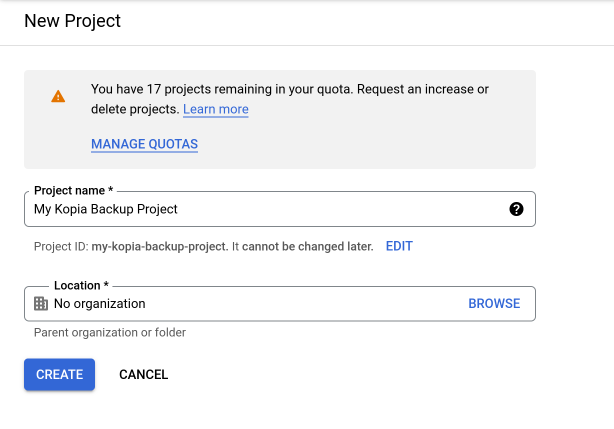
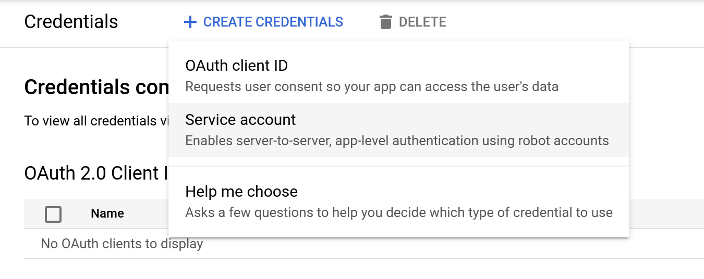
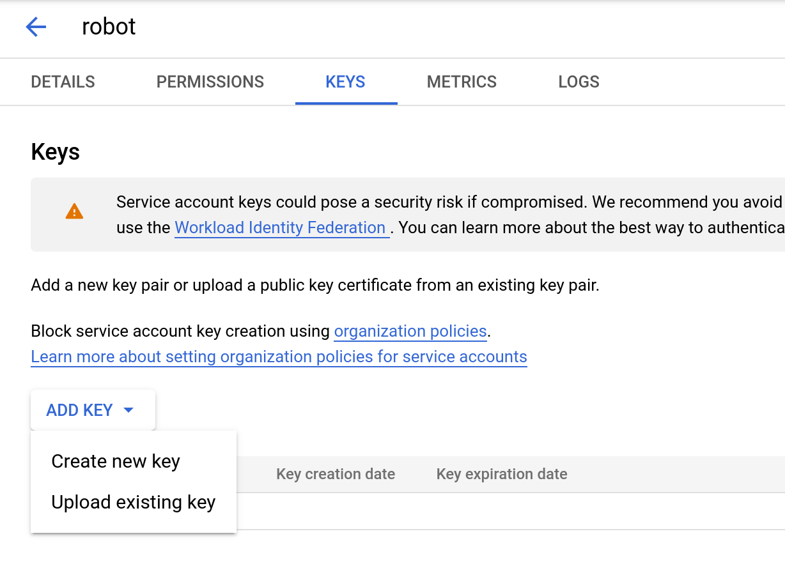

Kopia allows you to save your [encrypted] snapshots (i.e., backups) to a variety of storage locations, and in Kopia a storage location is called a `repository`. Kopia supports all of the following storage locations:

> Remember, you pick the storage locations you want to use. Kopia plays no role in selecting your storage locations. You must provision, setup, and pay (the storage provider) for whatever storage locations you want to use **before** you create a `repository` for that storage location to Kopia.

* [Amazon S3 and S3-compatible cloud storage](#amazon-s3-and-s3-compatible-cloud-storage)
  * Kopia supports all cloud storage that uses Amazon S3's API
    * For example: MinIO, Wasabi, IDrive E2, Storj, Cloudflare R2, Oracle Cloud Infrastructure, IBM Cloud, DigitalOcean Spaces, Amazon Lightsail, Vultr, Linode, Scaleway, Synology c2, MEGA.io S4, Contabo, OVH, Dreamhost, Alibaba Cloud, Tencent Cloud, Yandex Cloud, Mail.ru Cloud, and many more!
  * Kopia supports object locking and [storage tiers](../advanced/amazon-s3/) for any cloud storage that supports the features using the Amazon S3 API!
* [Azure Blob Storage](#azure-blob-storage)
* [Backblaze B2](#backblaze-b2)
* [Google Cloud Storage](#google-cloud-storage)
* [Google Drive](#google-drive)
  * Native support for Google Drive in Kopia is currently experimental
  * Native Google Drive support operates differently than Kopia's support for Google Drive through Rclone (see below); you will not be able to use the two interchangably, so pick one
* All remote servers or cloud storage that support [WebDAV](#webdav) 
* All remote servers or cloud storage that support [SFTP](#sftp)
* Dropbox, OneDrive, Google Drive, and all cloud storage supported by [Rclone](#rclone) 
  * Rclone is a (free and open-source) third-party program that you must download and setup seperately before you can use it with Kopia
  * Once you setup Rclone, Kopia automatically manages Rclone for you, so you do not need to do much beyond the initial setup, aside from ensuring Rclone is kept up-to-date
  * Kopia's Rclone support is experimental and all the cloud storage supported by Rclone has not been tested to work with Kopia; Kopia has been tested to work with Dropbox, OneDrive, and Google Drive through Rclone
* Your local machine 
* Any network-attached storage or server 
* Your own remote server by setting up a [Kopia Repository Server](../docs/repository-server/)

> PRO TIP: Many cloud storage providers offer a variety of [storage tiers](../docs/advanced/storage-tiers/) that may (or may not) help decrease your cost of cloud storage, depending on your use case. See the [storage tiers documentation](/docs/advanced/storage-tiers/) to learn the different types of files Kopia stores in repositories and which one of these file types you can possibly move to archive tiers, such as Amazon Deep Glacier.

## Amazon S3 and S3-compatible cloud storage

Creating an Amazon S3 or S3-compatible storage `repository` is done differently depending on if you use Kopia GUI or Kopia CLI.

### Kopia GUI

Select the `Amazon S3 and Compatible Storage` option in the `Repository` tab in `KopiaUI`. Then, follow on-screen instructions.  You will need to enter `Bucket` name, `Server Endpoint`, `Access Key ID`, and `Secret Access Key`. You can optionally enter an `Override Region` and `Session Token`.

> NOTE: Some S3-compatible cloud storage may have slightly different names for bucket, endpoint, access key, secret key, region, and session token. This will vary between cloud storages. Read the help documentation for the cloud storage you are using to find the appropriate values. You can typically find this information by searching for the S3 API settings for your cloud storage.

You will next need to enter the repository password that you want. Remember, this [password is used to encrypt your data](../docs/faqs/#how-do-i-enable-encryption), so make sure it is a secure password! At this same password screen, you have the option to change the `Encryption` algoirthm, `Hash` algorithm, `Splitter` algorithm, `Repository Format`, `Username`, and `Hostname`. Click the `Show Advanced Options` button to access these settings. If you do not understand what these settings are, do not change them because the default settings are the best settings.

> NOTE: Some settings, such as object locking and [actions](../docs/advanced/actions/), can only be enabled when you create a new `repository` using command-line (see next section). However, once you create the `repository` via command-line, you can use the `repository` as normal in Kopia GUI: just connect to the `repository` as described above after you have created it in command-line.

Once you do all that, your repository should be created and you can start backing up your data!

### Kopia CLI

### Creating a repository

You must use the [`kopia repository create s3` command](../reference/command-line/common/repository-create-s3/) to create a `repository`:

```shell
$ kopia repository create s3 \
        --bucket=... \
        --access-key=... \
        --secret-access-key=...
```

At a minimum, you will need to enter the bucket name, access key, and secret access key. If you are not using Amazon S3 and are using an S3-compatible storage, you will also need to enter the endpoint and may need to enter the `region`. There are also various other options (such as object locking and [actions](../docs/advanced/actions/)) you can change or enable -- see the [help docs](../reference/command-line/common/repository-create-s3/) for more information.

You will be asked to enter the repository password that you want. Remember, this [password is used to encrypt your data](../docs/faqs/#how-do-i-enable-encryption), so make sure it is a secure password!

### Connecting To Repository

After you have created the `repository`, you connect to it using the [`kopia repository connect s3` command](../docs/reference/command-line/common/repository-connect-s3/). Read the [help docs](../docs/reference/command-line/common/repository-connect-s3/) for more information on the options available for this command.

## Azure Blob Storage

Creating an Azure Blob Storage `repository` is done differently depending on if you use Kopia GUI or Kopia CLI.

### Kopia GUI

Select the `Azure Blob Storage` option in the `Repository` tab in `KopiaUI`. Then, follow on-screen instructions.  You will need to enter `Container` name, `Storage Account` name and either `Access Key` or `SAS Token`. You can optionally enter an `Azure Storage Domain`.

You will next need to enter the repository password that you want. Remember, this [password is used to encrypt your data](../docs/faqs/#how-do-i-enable-encryption), so make sure it is a secure password! At this same password screen, you have the option to change the `Encryption` algoirthm, `Hash` algorithm, `Splitter` algorithm, `Repository Format`, `Username`, and `Hostname`. Click the `Show Advanced Options` button to access these settings. If you do not understand what these settings are, do not change them because the default settings are the best settings.

> NOTE: Some settings, such as object locking and [actions](../docs/advanced/actions/), can only be enabled when you create a new `repository` using command-line (see next section). However, once you create the `repository` via command-line, you can use the `repository` as normal in Kopia GUI: just connect to the `repository` as described above after you have created it in command-line.

Once you do all that, your repository should be created and you can start backing up your data!

### Kopia CLI

### Creating a repository

You must use the [`kopia repository create azure` command](../reference/command-line/common/repository-create-azure/) to create a `repository`:

```shell
$ kopia repository create azure \
        --container=... \
        --storage-account=... \
        --storage-key=...
```

OR

```shell
$ kopia repository create azure \
        --container=... \
        --storage-account=... \
        --sas-token=...
```

At a minimum, you will need to enter the container name, storage account name, and either your Azure account access key/storage key or a SAS token. There are also various other options (such as object locking and [actions](../docs/advanced/actions/)) you can change or enable -- see the [help docs](../reference/command-line/common/repository-create-azure/) for more information.

You will be asked to enter the repository password that you want. Remember, this [password is used to encrypt your data](../docs/faqs/#how-do-i-enable-encryption), so make sure it is a secure password!

### Connecting To Repository

After you have created the `repository`, you connect to it using the [`kopia repository connect azure` command](../docs/reference/command-line/common/repository-connect-azure/). Read the [help docs](../docs/reference/command-line/common/repository-connect-azure/) for more information on the options available for this command.

## Backblaze B2

Creating Backblaze B2 storage `repository` is done differently depending on if you use Kopia GUI or Kopia CLI.

> NOTE: Currently, object locking is supported for Backblaze B2 but only through Kopia's [S3-compatabile storage `repository`](#amazon-s3-and-s3-compatible-cloud-storage) and not through the Backblaze B2 `repository` option. However, Backblaze B2 is fully S3 compatible, so you can setup your Backblaze B2 account via Kopia's [S3 `repository` option](#amazon-s3-and-s3-compatible-cloud-storage).

### Kopia GUI

Select the `Backblaze B2` option in the `Repository` tab in `KopiaUI`. Then, follow on-screen instructions.  You will need to enter `B2 Bucket` name, `Key ID`, and appliation `Key`.

You will next need to enter the repository password that you want. Remember, this [password is used to encrypt your data](../docs/faqs/#how-do-i-enable-encryption), so make sure it is a secure password! At this same password screen, you have the option to change the `Encryption` algoirthm, `Hash` algorithm, `Splitter` algorithm, `Repository Format`, `Username`, and `Hostname`. Click the `Show Advanced Options` button to access these settings. If you do not understand what these settings are, do not change them because the default settings are the best settings.

> NOTE: Some settings, such as [actions](../docs/advanced/actions/), can only be enabled when you create a new `repository` using command-line (see next section). However, once you create the `repository` via command-line, you can use the `repository` as normal in Kopia GUI: just connect to the `repository` as described above after you have created it in command-line.

Once you do all that, your repository should be created and you can start backing up your data!

### Kopia CLI

### Creating a repository

You must use the [`kopia repository create b2` command](../reference/command-line/common/repository-create-b2/) to create a `repository`:

```shell
$ kopia repository create b2 \
        --bucket=... \
        --key-id=... \
        --key=...
```

There are also various other options (such as [actions](../docs/advanced/actions/)) you can change or enable -- see the [help docs](../reference/command-line/common/repository-create-b2/) for more information.

You will be asked to enter the repository password that you want. Remember, this [password is used to encrypt your data](../docs/faqs/#how-do-i-enable-encryption), so make sure it is a secure password!

### Connecting To Repository

After you have created the `repository`, you connect to it using the [`kopia repository connect b2` command](../docs/reference/command-line/common/repository-connect-b2/). Read the [help docs](../docs/reference/command-line/common/repository-connect-b2/) for more information on the options available for this command.

## Google Cloud Storage

Google Cloud Storage is a globally unified, scalable, and highly durable object storage for developers and enterprises.

### Creating a repository

To create a repository in Google Cloud Storage you need to provision a storage bucket and install local credentials that can access that bucket. To do so, there are three methods (one that requires you to install Google Cloud SDK; the other method allows you to generate crendtials without Google Cloud SDK; the third method allows you to use Google Cloud Storage like it is AWS S3):

***Method #1: Installing Google Cloud SDK

1. Create a storage bucket in [Google Cloud Console](https://console.cloud.google.com/storage/)
2. Install [Google Cloud SDK](https://cloud.google.com/sdk/)
3. Log in with credentials that have permissions to the bucket.

```shell
$ gcloud auth application-default login
```

After these preparations we can create Kopia repository (assuming bucket named `kopia-test-123`):

```shell
$ kopia repository create gcs --bucket kopia-test-123
```

At this point we should be able to confirm that Kopia has created the skeleton of the repository with 3
files in it:

```shell
$ gsutil ls gs://kopia-test-123
gs://kopia-test-123/kopia.repository
gs://kopia-test-123/n417ffc2adc8dbe93f1814eda3ba8a07c
gs://kopia-test-123/p78e034ac8b891168df97f9897d7ec316
```

***Method #2: Creating a Service Account and Using the JSON File

1. Create a storage bucket in [Google Cloud Console](https://console.cloud.google.com/storage/)
2. Create a Google Cloud Service Account that allows you to access your storage bucket. Directions are available on [Google Cloud's website](https://cloud.google.com/docs/authentication/getting-started#create-service-account-console). Make sure to download the JSON file for your service account and keep it safe.

After these preparations we can create Kopia repository (assuming bucket named `kopia-test-123`):

```shell
$ kopia repository create gcs --credentials-file="/path/to/your/credentials/file.json" --bucket kopia-test-123
```

***Method #3: Enabling AWS S3 Interoperability in Google Cloud Storage

1. Create a storage bucket in [Google Cloud Console](https://console.cloud.google.com/storage/)
2. Go to [Settings and then Interoperability](https://console.cloud.google.com/storage/settings;tab=interoperability) in your Google Cloud Storage account
3. Enable your project under "Default project for interoperable access" and generate access keys for this project -- you will generate both access key and secret key, just like if you were using AWS S3

After these preparations we can create Kopia repository using the s3 function (assuming bucket named `kopia-test-123`):

```shell
$ kopia repository create s3 --endpoint="storage.googleapis.com" --bucket="kopia-test-123" --access-key="access/key/here" --secret-access-key="secret/key/here"
```

### Connecting To Repository

To connect to a repository that already exists, simply use `kopia repository connect` instead of `kopia repository create`. You can connect as many computers as you like to any repository, even simultaneously.

```shell
$ kopia repository connect gcs --bucket kopia-test-123
```

or 

```shell
$ kopia repository connect gcs --credentials-file="/path/to/your/credentials/file.json" --bucket kopia-test-123
```

or 

```shell
$ kopia repository connect s3 --endpoint="storage.googleapis.com" --bucket="kopia-test-123" --access-key="access/key/here" --secret-access-key="secret/key/here"
```

[Detailed information and settings](/docs/reference/command-line/common/repository-connect-filesystem/)

---

## Google Drive

Google Drive is a file storage and synchronization service developed by Google, which you can set up as a storage backend for Kopia.

> WARNING: Google Drive support is experimental, use at your own risk.

Kopia uses a Google Drive folder that you provide to store all the files in a repository. Kopia will only access files in this folder, and using Kopia does not impact your other Drive files. We recommend that you let Kopia manage this folder and do not upload any other content to this folder.

### Creating a repository

Here's a high-level rundown of what we will do:

1. Create or use an existing Google Drive folder for the new repository.

2. Create a [Service Account](https://cloud.google.com/iam/docs/understanding-service-accounts) for Kopia. A service account is a Google account for a robot user, and can be created and managed more easily than a real Gmail account.

3. Share the Google Drive folder with your new service account so that it can access the folder.

Ready? Here are the step-by-step instructions:

1. [Create a Google Cloud project](https://console.cloud.google.com/projectcreate), or use an existing one.
   
   

2. [Enable the Google Drive API](https://console.cloud.google.com/apis/library/drive.googleapis.com) using your project.
   
   

3. Create a service account. After enabling the API, you should be now prompted to [create credentials](https://console.cloud.google.com/apis/api/drive.googleapis.com/credentials). Choose "Service account" from the options, and give it a name. Note down the service account email.
   
   

4. Create a key for the service account. You can do this by viewing the service account, navigating to the "Keys" tab, and clicking "Add Key" -> "Create new key". You should choose "JSON" for the key type. Save the file on your computer.
   
   

5. Create or pick an existing Google Drive folder. The browser URL should look something like `https://drive.google.com/drive/u/0/folders/z63ZZ1Npv3OFvDPwU3dX0w`. Note down the last part of the URL. That's your folder ID.

6. Share the folder with the service account. Open the share dialog for the folder, and put in the service account email. You should choose the "Editor" as the access role.

After these preparations we can create a Kopia repository (assuming the folder ID is `z63ZZ1Npv3OFvDPwU3dX0w`):

```shell
$ kopia repository create gdrive \
        --folder-id z63ZZ1Npv3OFvDPwU3dX0w \
        --credentials-file=<where-you-have-stored-the-json-key-file>
```

If you view your folder on Google Drive, you should see that Kopia has created the skeleton of the repository with a `kopia.repository` file and a couple of others.

### Connecting To Repository

To connect to a repository that already exists, simply use `kopia repository connect` instead of `kopia repository create`.

You can connect as many computers as you like to any repository, even simultaneously. If you have multiple computers, we recommend that you create a new service account key for each computer for good security.

```shell
$ kopia repository connect gdrive \
        --folder-id z63ZZ1Npv3OFvDPwU3dX0w \
        --credentials-file=<where-you-have-stored-the-json-key-file>
```

[Detailed information and settings](/docs/reference/command-line/common/repository-connect-gdrive/)

---

## SFTP

The `SFTP` provider can be used to connect to a file server over SFTP/SSH protocol.

You must first configure passwordless SFTP login by following [these instructions](https://www.redhat.com/sysadmin/passwordless-ssh). Choose an empty passphrase because Kopia does not allow password prompts for the backend.

If everything is configured correctly, you should be able to connect to your SFTP server without any password by using:

```
$ sftp some-user@my-server
Connected to my-server.
sftp>
```


### Creating a repository

Once the passwordless connection works, then you can create a Kopia SFTP repository. Assuming you want the files to be stored under `/remote/path`, run the command below. Adjust the username and paths to the key file and known hosts file as necessary.

```shell
$ kopia repository create sftp \
        --host my-server \
        --username some-user \
        --keyfile ~/.ssh/id_rsa \
        --known-hosts ~/.ssh/known_hosts \
        --path /remote/path
```

When prompted, enter Kopia password to encrypt the repository contents.

If everything is done correctly, you should be able to verify that SFTP server indeed has Kopia files in the provided location, including special file named `kopia.repository.f`:

```
$ sftp some-user@my-server
sftp> ls -al /remote/path
-rw-r--r--    1 some-user  some-user  661 Sep 18 16:12 kopia.repository.f
```

### Connecting To Repository

To connect to an existing SFTP repository, simply use `connect` instead of `create`:

```shell
$ kopia repository connect sftp \
        --host my-server \
        --username some-user \
        --keyfile ~/.ssh/id_rsa \
        --known-hosts ~/.ssh/known_hosts \
        --path /remote/path
```

If the connection to SFTP server does not work, try adding `--external` which will launch external `ssh` process, which supports more connectivity options which may be needed for some hosts.

[Detailed information and settings](/docs/reference/command-line/common/repository-connect-sftp/)

---

## Rclone

Kopia can connect to certain backends supported by [Rclone](https://rclone.org) as long as they support
server-side timestamps.

>WARNING: Rclone support is experimental, use at your own risk.

### Creating a repository

First you should follow rclone instructions for setting up a remote. This is provider specific, detailed instructions can be found at https://rclone.org/#providers.

Assuming you've configured a remote named `my-remote`, you may create Kopia repository using:

```shell
$ kopia repository create rclone --remote-path my-remote:/some/path
```

### Connecting to repository

```shell
$ kopia repository connect rclone --remote-path my-remote:/some/path
```

[Detailed information and settings](/docs/reference/command-line/common/repository-connect-rclone/)

---

## Local storage

Local storage includes any directory mounted and accessible. You can mount any readable directory available on your storage, a directory on usb device, a directory mounted with smb, ntfs, sshfs or similar.

### Creating a repository

```shell
$ kopia repository create filesystem --path /tmp/my-repository
```

### Connecting to repository

```shell
$ kopia repository connect filesystem --path /tmp/my-repository
```

We can examine the directory to see which files were created. As you can see Kopia uses sharded directory structure to optimize performance.

```shell
$ find /tmp/my-repository -type f
/tmp/my-repository/n1b/d00/aa56a13c1140142b39befb654a2.f
/tmp/my-repository/pea/8b5/e01d92618653ffbf2bb9961448d.f
/tmp/my-repository/kopia.repository.f
```

[Detailed information and settings](/docs/reference/command-line/common/repository-connect-filesystem/)
