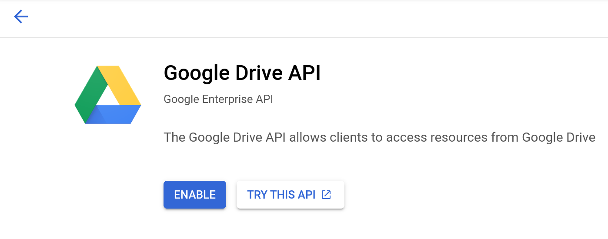

A repository is a place where Kopia stores its snapshot data. Kopia currently supports the following storage backends:

* [Google Cloud Storage](#google-cloud-storage)
* [Azure Blob Storage](#azure)
* [Amazon S3](#amazon-s3) (and compatible)
* [Backblaze B2](#b2)
* [Google Drive](#google-drive)
* [SFTP](#sftp)
* [WebDAV](#webdav)
* [Rclone](#rclone)
* [Local storage](#local-storage)

In addition, Kopia can connect to a [Kopia Repository Server](/docs/repository-server/) that acts as a proxy for the storage backend.

Many storage providers offer products with a variety of "tiers" suitable for different use cases. Choosing appropriate storage tiers may result in lower costs depending on, for example, how frequently data needs to be retrieved. See [Storage Tiers](/docs/advanced/storage-tiers/) for further details.

## Google Cloud Storage

Google Cloud Storage is a globally unified, scalable, and highly durable object storage for developers and enterprises.

### Creating a repository

To create a repository in Google Cloud Storage you need to provision a storage bucket and install local credentials that can access that bucket. To do so, there are three methods (one that requires you to install Google Cloud SDK; the other method allows you to generate crendtials without Google Cloud SDK; the third method allows you to use Google Cloud Storage like it is AWS S3):

***Method #1: Installing Google Cloud SDK

1. Create a storage bucket in [Google Cloud Console](https://console.cloud.google.com/storage/)
2. Install [Google Cloud SDK](https://cloud.google.com/sdk/)
3. Log in with credentials that have permissions to the bucket.

```shell
$ gcloud auth application-default login
```

After these preparations we can create Kopia repository (assuming bucket named `kopia-test-123`):

```shell
$ kopia repository create gcs --bucket kopia-test-123
```

At this point we should be able to confirm that Kopia has created the skeleton of the repository with 3
files in it:

```shell
$ gsutil ls gs://kopia-test-123
gs://kopia-test-123/kopia.repository
gs://kopia-test-123/n417ffc2adc8dbe93f1814eda3ba8a07c
gs://kopia-test-123/p78e034ac8b891168df97f9897d7ec316
```

***Method #2: Creating a Service Account and Using the JSON File

1. Create a storage bucket in [Google Cloud Console](https://console.cloud.google.com/storage/)
2. Create a Google Cloud Service Account that allows you to access your storage bucket. Directions are available on [Google Cloud's website](https://cloud.google.com/docs/authentication/getting-started#create-service-account-console). Make sure to download the JSON file for your service account and keep it safe.

After these preparations we can create Kopia repository (assuming bucket named `kopia-test-123`):

```shell
$ kopia repository create gcs --credentials-file="/path/to/your/credentials/file.json" --bucket kopia-test-123
```

***Method #3: Enabling AWS S3 Interoperability in Google Cloud Storage

1. Create a storage bucket in [Google Cloud Console](https://console.cloud.google.com/storage/)
2. Go to [Settings and then Interoperability](https://console.cloud.google.com/storage/settings;tab=interoperability) in your Google Cloud Storage account
3. Enable your project under "Default project for interoperable access" and generate access keys for this project -- you will generate both access key and secret key, just like if you were using AWS S3

After these preparations we can create Kopia repository using the s3 function (assuming bucket named `kopia-test-123`):

```shell
$ kopia repository create s3 --endpoint="storage.googleapis.com" --bucket="kopia-test-123" --access-key="access/key/here" --secret-access-key="secret/key/here"
```

### Connecting To Repository

To connect to a repository that already exists, simply use `kopia repository connect` instead of `kopia repository create`. You can connect as many computers as you like to any repository, even simultaneously.

```shell
$ kopia repository connect gcs --bucket kopia-test-123
```

or 

```shell
$ kopia repository connect gcs --credentials-file="/path/to/your/credentials/file.json" --bucket kopia-test-123
```

or 

```shell
$ kopia repository connect s3 --endpoint="storage.googleapis.com" --bucket="kopia-test-123" --access-key="access/key/here" --secret-access-key="secret/key/here"
```

[Detailed information and settings](/docs/reference/command-line/common/repository-connect-filesystem/)

---

## Amazon S3

Kopia can connect to S3 compatible storage, such as [Amazon S3](https://aws.amazon.com/s3/), [minio.io](https://minio.io/), [Wasabi](https://wasabi.com/)

### Creating a repository

You will need your S3 bucket name, access key and secret access key.

```shell
$ kopia repository create s3 \
        --bucket=... \
        --access-key=... \
        --secret-access-key=...
```

### Connecting To Repository

```shell
$ kopia repository connect s3
```

[Detailed information and settings](/docs/reference/command-line/common/repository-create-s3/)

---

## B2

[B2](https://www.backblaze.com/b2/cloud-storage.html) is a very cheap yet fully featured S3 compatible storage.

### Creating a repository

You will need your B2 bucket name, key-id and key.

```shell
$ kopia repository create b2 \
        --bucket=... \
        --key-id=... \
        --key=...
```

### Connecting To Repository

```shell
$ kopia repository connect b2
```

[Detailed information and settings](/docs/reference/command-line/common/repository-connect-b2/)

---

## Google Drive

Google Drive is a file storage and synchronization service developed by Google, which you can set up as a storage backend for Kopia.

> WARNING: Google Drive support is experimental, use at your own risk.

Kopia uses a Google Drive folder that you provide to store all the files in a repository. Kopia will only access files in this folder, and using Kopia does not impact your other Drive files. We recommend that you let Kopia manage this folder and do not upload any other content to this folder.

### Creating a repository

Here's a high-level rundown of what we will do:

1. Create or use an existing Google Drive folder for the new repository.

2. Create a [Service Account](https://cloud.google.com/iam/docs/understanding-service-accounts) for Kopia. A service account is a Google account for a robot user, and can be created and managed more easily than a real Gmail account.

3. Share the Google Drive folder with your new service account so that it can access the folder.

Ready? Here are the step-by-step instructions:

1. [Create a Google Cloud project](https://console.cloud.google.com/projectcreate), or use an existing one.
   
   

2. [Enable the Google Drive API](https://console.cloud.google.com/apis/library/drive.googleapis.com) using your project.
   
   

3. Create a service account. After enabling the API, you should be now prompted to [create credentials](https://console.cloud.google.com/apis/api/drive.googleapis.com/credentials). Choose "Service account" from the options, and give it a name. Note down the service account email.
   
   

4. Create a key for the service account. You can do this by viewing the service account, navigating to the "Keys" tab, and clicking "Add Key" -> "Create new key". You should choose "JSON" for the key type. Save the file on your computer.
   
   

5. Create or pick an existing Google Drive folder. The browser URL should look something like `https://drive.google.com/drive/u/0/folders/z63ZZ1Npv3OFvDPwU3dX0w`. Note down the last part of the URL. That's your folder ID.

6. Share the folder with the service account. Open the share dialog for the folder, and put in the service account email. You should choose the "Editor" as the access role.

After these preparations we can create a Kopia repository (assuming the folder ID is `z63ZZ1Npv3OFvDPwU3dX0w`):

```shell
$ kopia repository create gdrive \
        --folder-id z63ZZ1Npv3OFvDPwU3dX0w \
        --credentials-file=<where-you-have-stored-the-json-key-file>
```

If you view your folder on Google Drive, you should see that Kopia has created the skeleton of the repository with a `kopia.repository` file and a couple of others.

### Connecting To Repository

To connect to a repository that already exists, simply use `kopia repository connect` instead of `kopia repository create`.

You can connect as many computers as you like to any repository, even simultaneously. If you have multiple computers, we recommend that you create a new service account key for each computer for good security.

```shell
$ kopia repository connect gdrive \
        --folder-id z63ZZ1Npv3OFvDPwU3dX0w \
        --credentials-file=<where-you-have-stored-the-json-key-file>
```

[Detailed information and settings](/docs/reference/command-line/common/repository-connect-gdrive/)

---

## SFTP

The `SFTP` provider can be used to connect to a file server over SFTP/SSH protocol.

You must first configure passwordless SFTP login by following [these instructions](https://www.redhat.com/sysadmin/passwordless-ssh). Choose an empty passphrase because Kopia does not allow password prompts for the backend.

If everything is configured correctly, you should be able to connect to your SFTP server without any password by using:

```
$ sftp some-user@my-server
Connected to my-server.
sftp>
```


### Creating a repository

Once the passwordless connection works, then you can create a Kopia SFTP repository. Assuming you want the files to be stored under `/remote/path`, run the command below. Adjust the username and paths to the key file and known hosts file as necessary.

```shell
$ kopia repository create sftp \
        --host my-server \
        --username some-user \
        --keyfile ~/.ssh/id_rsa \
        --known-hosts ~/.ssh/known_hosts \
        --path /remote/path
```

When prompted, enter Kopia password to encrypt the repository contents.

If everything is done correctly, you should be able to verify that SFTP server indeed has Kopia files in the provided location, including special file named `kopia.repository.f`:

```
$ sftp some-user@my-server
sftp> ls -al /remote/path
-rw-r--r--    1 some-user  some-user  661 Sep 18 16:12 kopia.repository.f
```

### Connecting To Repository

To connect to an existing SFTP repository, simply use `connect` instead of `create`:

```shell
$ kopia repository connect sftp \
        --host my-server \
        --username some-user \
        --keyfile ~/.ssh/id_rsa \
        --known-hosts ~/.ssh/known_hosts \
        --path /remote/path
```

If the connection to SFTP server does not work, try adding `--external` which will launch external `ssh` process, which supports more connectivity options which may be needed for some hosts.

[Detailed information and settings](/docs/reference/command-line/common/repository-connect-sftp/)

---

## Rclone

Kopia can connect to certain backends supported by [Rclone](https://rclone.org) as long as they support
server-side timestamps.

>WARNING: Rclone support is experimental, use at your own risk.

### Creating a repository

First you should follow rclone instructions for setting up a remote. This is provider specific, detailed instructions can be found at https://rclone.org/#providers.

Assuming you've configured a remote named `my-remote`, you may create Kopia repository using:

```shell
$ kopia repository create rclone --remote-path my-remote:/some/path
```

### Connecting to repository

```shell
$ kopia repository connect rclone --remote-path my-remote:/some/path
```

[Detailed information and settings](/docs/reference/command-line/common/repository-connect-rclone/)

---

## Local storage

Local storage includes any directory mounted and accessible. You can mount any readable directory available on your storage, a directory on usb device, a directory mounted with smb, ntfs, sshfs or similar.

### Creating a repository

```shell
$ kopia repository create filesystem --path /tmp/my-repository
```

### Connecting to repository

```shell
$ kopia repository connect filesystem --path /tmp/my-repository
```

We can examine the directory to see which files were created. As you can see Kopia uses sharded directory structure to optimize performance.

```shell
$ find /tmp/my-repository -type f
/tmp/my-repository/n1b/d00/aa56a13c1140142b39befb654a2.f
/tmp/my-repository/pea/8b5/e01d92618653ffbf2bb9961448d.f
/tmp/my-repository/kopia.repository.f
```

[Detailed information and settings](/docs/reference/command-line/common/repository-connect-filesystem/)
