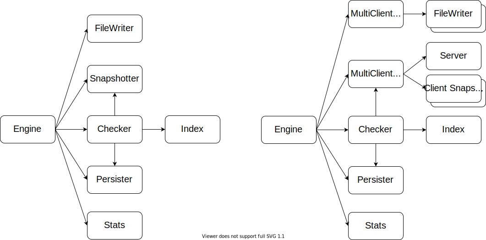

# Multi-client Robustness Test

The Kopia multi-client robustness test is intended to verify the correct restoration of application persistent data over time. The test design is similar to the standard Kopia robustness test, reusing the main test engine and most of its components. However, this test suite uses Kopia's client-server mechanisms to run multiple clients concurrently.

## Components

The multi-client Kopia robustness test has the following components:

- `MultiClientFileWriter`  
  This is an implementation of the `robustness.FileWriter` interface that creates and manages client `FileWriter`'s. In addition, the `MultiClientFileWriter` delegates `FileWriter` function calls to a client's specific `FileWriter`.

- `MultiClientSnapshotter`  
  This is an implementation of the `Snapshotter` interface that creates and manages a single `Server` and one `ClientSnapshotter` per client. In addition, the `MultiClientSnapshotter` delegates `Snapshotter` function calls to a client's specific `ClientSnapshotter`.

- `Server`  
  This is the component responsible for setting up and managing the Kopia server. It has the following functionality:
  - Set up or connect to a Kopia repository and create a server for clients to connect to
  - Add and remove permissions for new clients
  - Run commands directly on the Kopia repo, such as garbage collection

- `ClientSnapshotter`  
  This is a `Snapshotter` with the added functionality of being able to connect to and disconnect from a server.

The diagram below shows the standard Kopia robustness test framework on the left and the multi-client framework on the right. It illustrates how the components described above fit into the engine and delegate actions to client instantiations of the `FileWriter` and `ClientSnapshotter` components.



## Creating Multi-client Tests

The file `multiclient_test.go` contains the existing tests, which can be used as an example. The snippet below shows how to use the multi-client framework to create a test with four concurrent clients.

```go
func TestExample(t *testing.T) {
	numClients := 4

	// Define per-client test actions
	f := func(ctx context.Context, t *testing.T) {
		t.Helper()

		_, err := eng.ExecAction(ctx, /* engine-action-key */, /* opts */)
		// ... other actions ...
	}

	// Create or obtain root context
	ctx := testlogging.Context(t)

	// Run test actions for each client concurrently
	th.RunN(ctx, t, numClients, f)
}
```
